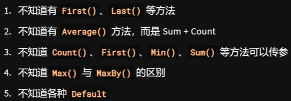
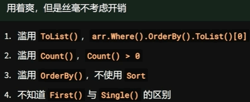

# LINQ

- 语言集成查询(Language-Integrated Query)

### 用途

- .NET原生集合(List,Array,Dictionary,etc)
- SQL数据库(搭配ORM)
- XML文档
- JSON文档(Newtonsoft_Json)

### 常用功能

- 排序，筛选，选择
- 分组，聚合，合并
- 最大值，最小值，求和，求平均，求数量

### 两种形式

- 查询表达式query expression结尾必须是group或者select
- 链式表达式chained expression

  - ```c#
    var lst = new List<int>{1,2,3,5,8,4,7,9}
    
    //even,>= 2 and sort 
    //传统命令式编程
    var res = new List<int>();
    foreach(var n in lst)
        if(n%2==0&&n>=2)
            res.Add(n);
    res.Sort();
    res.Dump();
    //查询表达式
    var res =
        from n in lst
        where n%2==0
        orderby n
        select n;//表示语句完结
    res.Dump();
    //链式表达式
    var res = lst
        //筛选每一个为n
        .Where(n=>n%2==0&&n>=2)
        .OrderBy(n=>n)
    res.Dump();
    ```

    ```c#
    var arr1 = new int[] { 1, 2, 3, 31, 4, 5, 6 };
    var arr2 = new int[] { 2, 2, 3, 3, 42, 5, 69 };
    
    //var res1 = arr1.Intersect(arr2).Dump();
    
    var res1 =
        from n in arr1
        where arr2.Contains(n)
        select n;
    res1.Dump();
    ```

    ```csharp
    var rnd = new Random(1232);
    var arr = Enumerable.Range(0, 300).Select(_ => rnd.Next(30));
    
    var res = arr
        .GroupBy(x => x)
        //.Select(g => new { g.Key, Count = g.Count })
        .ToDictionary(g=>g.Key,g=>g.Count())
        .Dump;
    
    var res =
        from x in arr
        group x by x into g
        select new {g.key,Count=g.Count()};
    res.Dump();
    ```
    

### 查询表达式的延迟执行与消耗

1. 延迟执行

   - ```c#
     var query=list.Select(x=>{
     	Thread.Sleep(1000);
     	return x*x;
     });
     "finish".Dump();//不执行上面代码
     query.Dump();//执行上述代码
     ```

     

- 遍历

- ToList(),ToArray(),ToDictionary()

- Count(),Min(),Max(),Sum()

- LINQ不仅仅是可枚举类型的拓展方法

  - IENmuerable

  - IOrderedEnumerable

  - IQueryable

  - ParallelQuery

  - ```c#
    var arr = Enumerable
    	.Range(1,10);
    	.ToArray()
    	.AsParallel()
    	.AsOrdered()
    	.Select(x=>{
    		Thread.Sleep(500)
    		return x*x;
    	})
    	.AsSequential()
    	.Dump();
    ```

    ```c#
    //展平
    var mat = new int[] []{
        new[]{1,2,3,4,5},
        new[]{5,3,2,5,6},
        new[]{7,6,8,6,4}
    };
    
    //var res=
    //    from row in mat
    //    from n in row
    //    select n;
    //res.ToArray().Dump();
    
    var res=mat
        .SelectMany(n=>n);
    res.ToArray().Dump();
    ```

    ```c#
    //字母频率
    var words = new string[]{
        "jean","yang","wang","tom","jean","zhang","yang","tom","tom"
    };
    //查询表达式
    var quer =
        from w in words
        from c in w
        group c by c into g
        select new{g.Key,Count=g.Count()} into a
        orderby a.Count descending
        select a;
    //链式表达式
    var query=words
        .SelectMany(c=>c)
        .GroupBy(c=>c)
        .Select(g=>new{g.Key,Count=g.Count})
        .OrderBy(g=>g.Count);
    query.Dump();
    ```

### 常见错误
- 

- 

  


