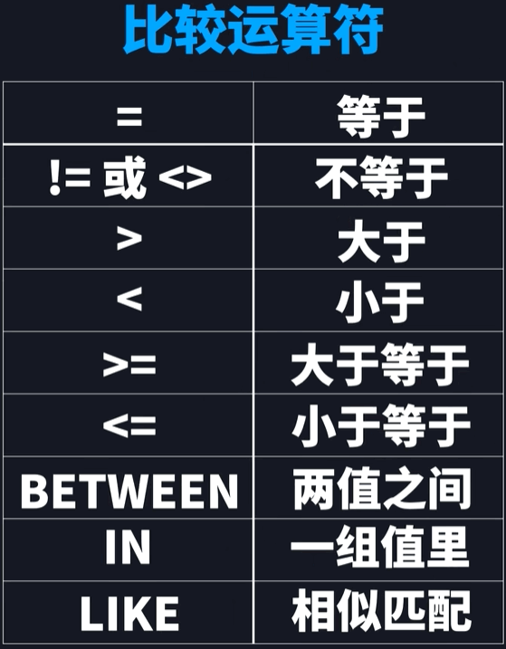
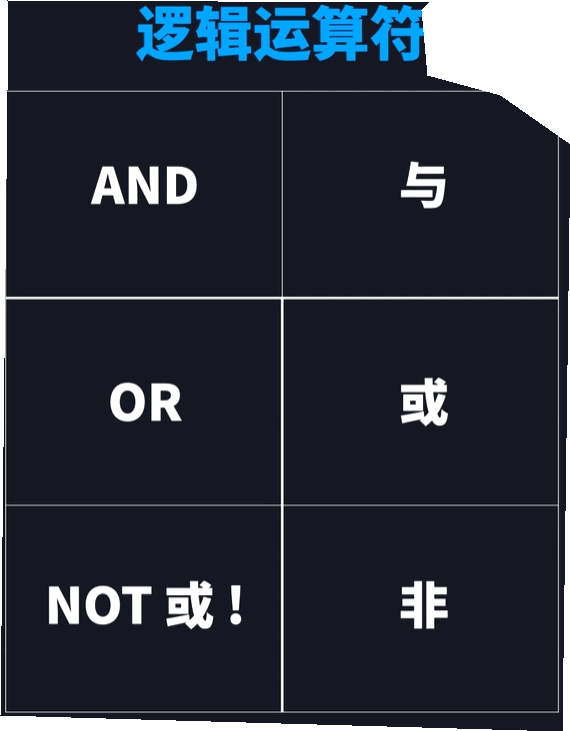

### 增


### 删
```sql
-- DELETE FROM 数据库名.表明
-- WHERE 条件
delete from class.student;
where id = 3;

-- 删除整个表格或者数据库
-- DROP TABLE 数据库名.表格名
-- DROP DATABASE 数据库名
drop table studnet;
drop database class;
```
### 改

```sql
-- ALTER TABLE 数据库名.表名
-- ADD 列名 数据类型 默认条件
alter table class.student;
add name int null;

-- UPDATE 数据库表明，表格名
-- SET 值
-- WHERE 条件
update class.student
set age = 20
where id = 3;
```
### 查

```sql
-- SELECT * FROM 表格名;查看全部内容
-- SELECT 列名1,列名2 FROM 表格名; 查看某列
select * from student;
select name,age,id from student;

-- SELECT DISTINCT * FROM 表格名;数据不重复
select distinct age from student;

-- 排序
-- SELECT * FROM 表格名 ORDER BY 列名 ASC/DESC;
select * from student order by age asc;

-- 过滤
-- SELECT * FROM 表格名 WHERE 条件 ORDER BY 列名 ASC(default)/DESC;
select * from student
where age >= 20 and name != 'Tom'
order by id asc;
-- 取反加NOT
where not age >= 20 and name !='Tom'
-- 取范围 BETWEEN AND
where age between 23 and 30;
-- 用IN表示字符范围
where name in ('Tom','Jean')
-- 用LIKE 进行模糊查询,以某开头以某结尾，_表示任意字符
where name like 'W%'
where name like '%g'
where name like '__g%'
```




