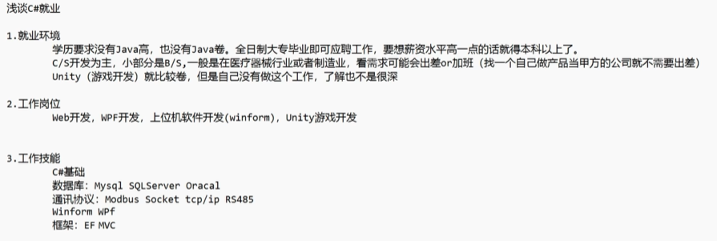

| 序号 | 学习内容                                  | 备注                                                         |
| ---- | ----------------------------------------- | ------------------------------------------------------------ |
| 1    | 编程语言：C#，C++（如果是在校生可以考虑） | 入门C#基础语法，推荐观看刘铁猛《#语言入门详解》全集（至少看两遍，并且跟着后面敲一遍刘哥的例子） |
| 2    | 学习winform(上手实践）                    | 计算器、文本编辑器、聊天工具(socket实现熟悉通信流程）、音乐/视频播放器（学习界面效果和文件的一些处理）、图书馆管理系统（学习C#中的数据库操作（推荐手写sql的ado.net)和Excel操作NPOI） |
| 3    | 了解MODBUS协议（推荐NMODBUS)              | 西门子：S7，欧姆龙：Flns                                     |
| 4    | 学习一些界面库或者直接学习WPF             | Winform: hzhcontrols(收费的但是学习是免费的)、Sunn ui、刘铁猛《深入浅出WPF》、HandyControls、MaterialDesign、图表: LiveChart、ScottPlot |

